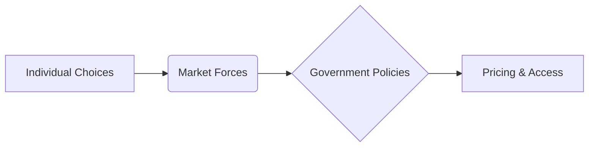

# Priced Out of Paradise
## Wealth Inequality and the Shrinking Slopes

Wealth inequality doesn't just mean different income levels; it reshapes entire markets, pushing essential goods and experiences out of reach for many. Businesses, reacting to wealth distribution, often cater to the affluent, leaving those with less purchasing power "priced out." This exploration uses ski resorts as a case study, but the dynamics apply across various sectors, impacting access to everything from housing and healthcare to leisure and recreation.

**(Introduction - Visualization: Interactive Gini Coefficient Simulator with Sample Population)**

```js
const gini = Inputs.range([0, 1], {value: 0.5, step: 0.01, label: "Gini Coefficient"})

const population = d3.range(100).map(() => ({wealth: gini < 0.01 ? 1 : d3.randomLogNormal(0, Math.log(1 - gini))()}));

const chart1 = Plot.plot({
  y: {
    grid: true
  },
  marks: [
    Plot.rectY(population, Plot.binX({y: "count"}, {x: "wealth", thresholds: 20})),
    Plot.ruleY([0])
  ]
});

display(chart1)
```

Wealth inequality, a growing concern, doesn't just manifest in income disparities. It fundamentally alters market dynamics, impacting pricing strategies and access. Businesses, reacting to wealth distribution, often cater to the affluent, leaving those with less purchasing power "priced out." Interact with the simulator to see how different levels of wealth inequality (represented by the Gini coefficient) affect the distribution of resources within a sample population. A higher Gini coefficient indicates greater inequality.


**(Examples Across Industries - Visualization: Scatter Plot Showing Price vs. Income for Various Goods/Services)**

```js
const products = [
  {product: "Luxury Gym Membership", price: 2000, income: 150000},
  {product: "Private School Tuition", price: 50000, income: 250000},
  {product: "Concierge Doctor", price: 10000, income: 200000},
  {product: "High-end Restaurant Meal", price: 500, income: 100000},
  {product: "Economy Car", price: 20000, income: 50000}
  // Add more data points here
];

const chart2 = Plot.plot({
  x: {
    label: "Median Household Income Required",
    tickFormat: d => `$${d}`
  },
  y: {
    label: "Product/Service Price",
    tickFormat: d => `$${d}`
  },
  marks: [
    Plot.dot(products, {x: "income", y: "price", title: "product"})
  ]
});

display(chart2)
```

This phenomenon is evident in various sectors. Luxury gyms, private schools, specialized healthcare – all cater to a wealthy clientele, effectively excluding those with lower incomes. Hover over each data point on the scatter plot to see specific examples of businesses catering to different income levels. Notice how price often correlates with the target consumer's income.


**(The Ski Industry Case Study - Visualization: Map Highlighting Ski Resort Prices vs. Local Median Incomes - *Requires Data*)**

**(This visualization requires integrating real-world data on ski resort prices and local median incomes. Placeholder below.)**

```js
// Placeholder for map visualization - requires data integration
const chart3 = Plot.plot({
  marks: [
    Plot.text(["Map visualization showing ski resort prices vs. local median incomes"])
  ]
});
display(chart3)
```

The ski industry offers a compelling example.  Historically, resorts catered to a broader range of skiers. However, increasing wealth inequality has incentivized them to focus on higher-paying customers. (Explore the map to compare ski resort prices with local median incomes in different regions).


**(Pricing Optimization - Visualization: Interactive Graph Showing Revenue vs. Price for Different Customer Segments - *Requires Model*)**

**(This visualization requires a model to simulate revenue based on different pricing strategies. Placeholder below.)**

```js
// Placeholder for revenue vs. price graph - requires model implementation
const chart4 = Plot.plot({
  marks: [
    Plot.text(["Interactive graph showing revenue vs. price for different customer segments"])
  ]
});
display(chart4)

```

Ski resorts face an optimization problem. Catering to a smaller, wealthier segment can be more profitable than serving a diverse clientele. This is exacerbated by global market forces, as international tourists with higher purchasing power further drive up prices. (Adjust the price point on the graph to see how revenue changes based on catering to different customer segments).


**(Equity and Access - Visualization: Chart Comparing Access to Ski Resorts Across Different Income Levels - *Requires Data*)**

**(This visualization requires data on access to ski resorts based on income. Placeholder below.)**

```js
// Placeholder for access vs. income chart - requires data integration
const chart5 = Plot.plot({
  marks: [
    Plot.text(["Chart comparing access to ski resorts across different income levels"])
  ]
});
display(chart5)
```

This trend raises crucial questions about equity and access. (The chart illustrates how access to ski resorts, measured by factors like lift ticket affordability and proximity to affordable housing, varies significantly across different income levels).


**(Conclusion - Visualization: Flowchart Showing the Interplay of Individual Choices, Market Forces, and Government Policies)**

**(A basic flowchart example using Mermaid syntax. Enhance within Observable.)**



While businesses respond to market forces, understanding the implications of their pricing strategies on broader societal well-being is crucial. Wealth inequality significantly impacts access and affordability, making it essential to consider the broader social impact of pricing decisions. 
